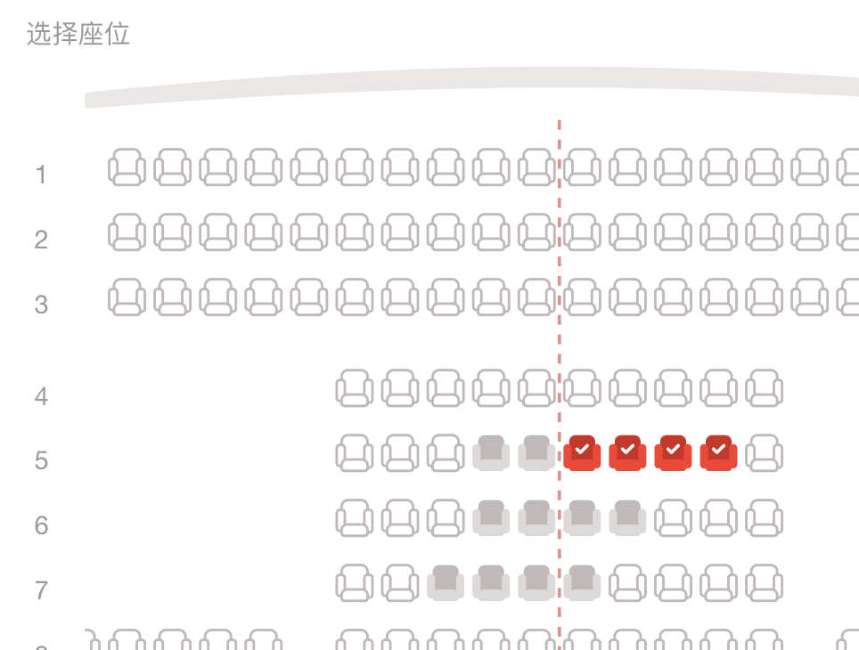
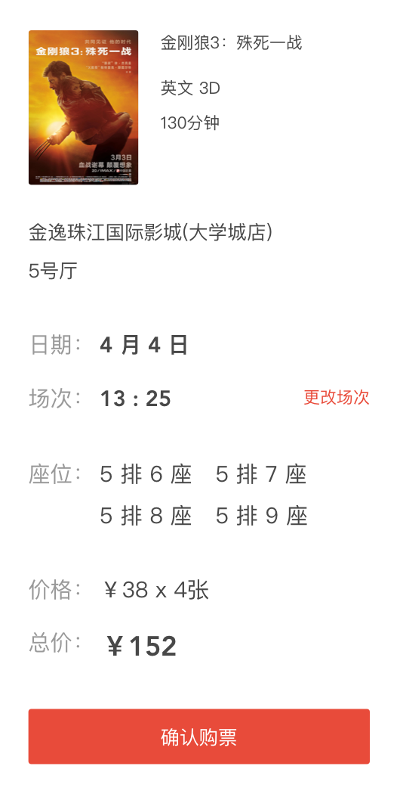
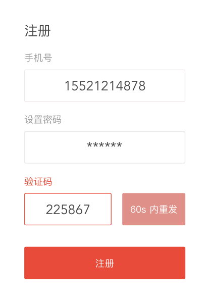
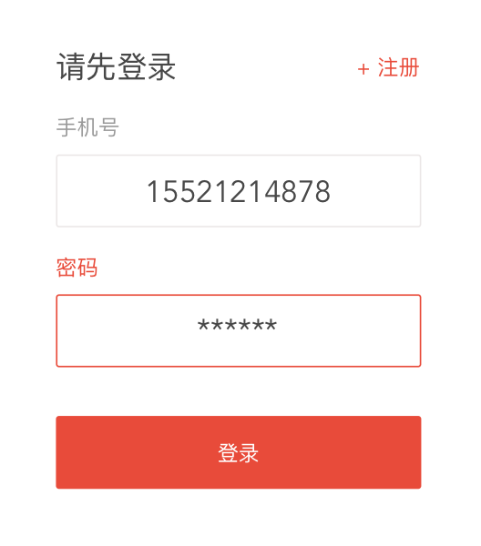

# 用户手册

## 欢迎使用 AwesomeTickets
您可以使用 AwesomeTickets 在线购买电影票。

## 购票

### 第 1 步：选择一部您喜爱的正在热映的电影
当您打开网站后，即可了解到正在热映的电影的相关讯息。

- 点击「购票」，进入下一步

### 第 2 步：选择合适的日期与影院
您可以根据当前选中日期的影讯，挑一个有合适排场的影院。

- 点击相应日期，例如「5月2日」，可更改选中日期
- 点击「选择场次」，进入下一步

### 第 3 步：挑一个您喜欢的场次
您可以根据当日影院的影讯，挑一个场次。

- 点击「选座购票」，进入下一步
- 点击相应日期，例如「5月2日」，可更改选中日期并返回上一步
- 点击「更改影院」，可返回上一步

### 第 4 步：选您喜欢的座位
您可以根据当前场次的座位情况，挑选喜欢的座位（一次订单最多预订4个座位）

- 点击座位，即可选座
- 确认座位信息与价格，点击「确认购票」，进入下一步（若未登录，则需要登录）
- 点击「更改场次」，可快速更改该影院当天的其他场次

### 最后一步：获取电子票
确认订票信息后，即可获取电子票

- 点击「确认订票」，获得取票码

## 注册及登录

### 注册
输入您的手机号，设置密码，并输入收到的短信验证码，即可完成注册。

### 登录
输入您已注册的手机号与密码，即可登录。

## 查询购票记录
当您已经登录后，即可点击网页右上角的「账户按「钮，即可显示您的购票记录。

## 取票
点击网页右上角的「取票」按钮，输入你订票所使用的手机号与对应的取票码，即可取票。

